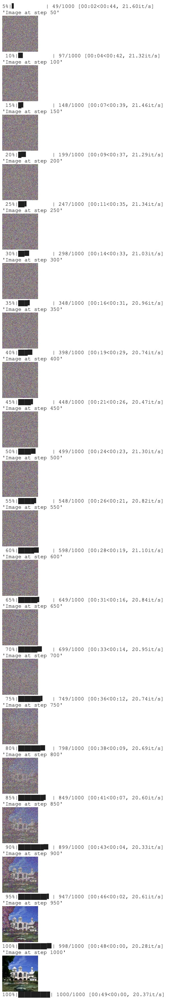

# Stable Diffusion with Hugging Face API

4 April 2023

**AIAP Group Sharing**

Presented by Group 1: Shu Ying, JF, Jia Hao and Yan Liong

## 1. Introduction

Stable Diffusion, a text-to-image deep learning model, was developed and released by the start-up Stability AI in August 2022. The user can input a text prompt in plain English, and the model would output an image to match the given prompt. Stable Diffusion quickly made news headlines and captured the popular imagination. In February 2023, Forbes reported that Stable Diffusion is used by "more than 10 million people on a daily basis" [1].

Before the arrival of Stable Diffusion, text-to-image diffision models such as DALL-E and Midjourney were publicly available only via cloud services. Stable Diffusion was the first diffision model which had its code and model weights released to the public, allowing users to run the model on their own modest hardware resources. [2]

Hugging Face has gathered recent diffusion models from independent repositories in a single community project, called the `diffusers` library. [3]

In this article, we walk through some code to demonstrate the use of the `diffusers` API, which allows us to perform inferencing to generate synthetic images.

## 2. What is Stable Diffusion?

[JH]

[Below is a draft by JF: Please feel free to use or discard.]

Diffusion models are denoising algorithms, trained using deep learning to remove random noise in a series of gradual steps. Starting with 100% noise, after a certain number of steps, the model finally outputs an image to match the text prompt [3].


The neural net typically follows the UNet architecture, which looks like this [3]:


Here is another view of the architecture:


Highlights of this architecture, explained in simplified terms:

- The size of the input images is the same as that of the output image [3].
- The input image is downsized using a series of ResNet layers and encoded into a much smaller (compressed) latent space (as a latent image tensor). [3, 4]
- As the latent space is small, this makes it faster for the forward and reverse diffusions to take place. [3, 4]
- From this latent space, the output image is decoded and upscaled to full size. [3, 4]
- The steps of the diffusion (computing a less noisy image) are defined in a scheduler.


## 3. FaceHugging's Pipeline Components

### The 4 main components in Hugging Face's diffusion are:

<br>
Text-Encoder

- The text-encoder transforms input prompts into an embedding space for the U-Net. A transformer-based encoder maps input tokens to latent text-embeddings. Stable Diffusion uses CLIP's pretrained text encoder, CLIPTextModel, without additional training.

Variational Autoencoder (VAE)
- The VAE consists of an encoder and a decoder, whose main goal is to transform an image back and from its latent space . During training, the encoder converts images into low-dimensional latent representations, serving as input for the U-Net model. During inference, the decoder transforms latent representations back into images.[6]

Scheduler
- The scheduling algorithm used to progressively add noise to the image during training.

U-Net
- U-Net has an encoder and a decoder, both composed of ResNet blocks, its goal is to process the latent images obtained from the VAE encoder. The encoder compresses image representation into lower resolution, while the decoder reconstructs the original, less noisy, high-resolution representation. U-Net output predicts noise residual for denoised image calculation. Shortcut connections between encoder's downsampling and decoder's upsampling ResNets prevent information loss. Stable diffusion U-Net conditions its output on text-embeddings via cross-attention layers in both encoder and decoder.[6]

<br>
<br>

## How the pipeline components work  

[6]


<br>
<br>

### a) Creating the components

```
from transformers import CLIPTextModel, CLIPTokenizer
from diffusers import AutoencoderKL, UNet2DConditionModel, PNDMScheduler

# 1. Load the autoencoder model which will be used to decode the latents into image space. 
vae = AutoencoderKL.from_pretrained("CompVis/stable-diffusion-v1-4", subfolder="vae")

# 2. Load the tokenizer and text encoder to tokenize and encode the text. 
tokenizer = CLIPTokenizer.from_pretrained("openai/clip-vit-large-patch14")
text_encoder = CLIPTextModel.from_pretrained("openai/clip-vit-large-patch14")

# 3. Create the scheduler
scheduler = LMSDiscreteScheduler.from_pretrained("CompVis/stable-diffusion-v1-4", subfolder="scheduler")

# 4. The UNet model for generating the latents.
unet = UNet2DConditionModel.from_pretrained("google/ddpm-church-256", subfolder="unet")
```

### b) Setup the text encoding

Initially, we obtain the text embeddings for the given prompt, which will serve as a basis for conditioning the UNet model.

```
text_input = tokenizer(prompt, padding="max_length", max_length=tokenizer.model_max_length, truncation=True, return_tensors="pt")

with torch.no_grad():
  text_embeddings = text_encoder(text_input.input_ids.to(torch_device))[0]
```

Furthermore, we will acquire unconditional text embeddings to provide classifier-free guidance, which consist solely of the embeddings for the padding token (empty text). It is crucial to ensure that their dimensions match those of the conditional text embeddings (i.e., batch_size and seq_length).

```
max_length = text_input.input_ids.shape[-1]
uncond_input = tokenizer(
    [""] * batch_size, padding="max_length", max_length=max_length, return_tensors="pt"
)
with torch.no_grad():
  uncond_embeddings = text_encoder(uncond_input.input_ids.to(torch_device))[0]   
```

To enable classifier-free guidance, we need to perform two separate forward passes. One pass is with the conditioned input (text_embeddings), while the other is with the unconditional embeddings (uncond_embeddings). To optimize computational efficiency, it is feasible to concatenate both sets of embeddings into a single batch, thus eliminating the need to perform two separate forward passes.

```
text_embeddings = torch.cat([uncond_embeddings, text_embeddings])
```
### c) Generate latent space
Next we generate the random latent space

```
latents = torch.randn(
  (batch_size, unet.in_channels, height // 8, width // 8),
  generator=generator,
)
latents = latents.to(torch_device)
```

### d) Schedulers Details

Unlike a model, a scheduler has no trainable weights (so is not inherited from torch.nn.Module), but is instantiated by a configuration. It is simply a step-by-step algorithm to compute the slightly less noisy sample. [3]

There are different types of schedulers. Different schedulers work with different models. [3]

We can print out the scheduler's configuration to take a look. Some of the more important config parameters are annotated below in the code.

```
print(scheduler.config)
```
Output:
```
FrozenDict([('num_train_timesteps', 1000),  # Length of the denoising process,
                                            # i.e. how many timesteps are need to process
                                            # random gaussian noise to a data sample.
            ('beta_start', 0.0001),         # Smallest noise value of the schedule.
            ('beta_end', 0.02),             # Highest noise value of the schedule.
            ('beta_schedule', 'linear'),    # Type of noise schedule that shall be used
                                            # for inference and training.
            ('trained_betas', None),
            ('variance_type', 'fixed_small'),
            ('clip_sample', True),
            ('_class_name', 'DDPMScheduler'),
            ('_diffusers_version', '0.3.0')])
```

The scheduler has a `step()` function which is used to compute the slightly less noisy image. The step function takes in a few arguments:

- A `noisy_residual` previously predicted by the model (difference between the slightly less noisy image and the input image).
- The timestep.
- The current `noisy_sample`.

```
less_noisy_sample = scheduler.step(
    model_output=noisy_residual, timestep=2, sample=noisy_sample
).prev_sample
print(less_noisy_sample.shape)
```
Output:
```
torch.Size([1, 3, 256, 256])
```

Notice that the output sample's shape is the same as the input, so it is can be looped back into the model again. [3]

### e) Updating the Current Schedulers

We update the scheduler with our chosen num_inference_steps. This will compute the sigmas and exact time step values to be used during the denoising process.

```
scheduler.set_timesteps(num_inference_steps)
```


The K-LMS scheduler necessitates the multiplication of latents with their corresponding sigma values. We can accomplish this step at this point.

```
latents = latents * scheduler.init_noise_sigma
```

### f) Model

We use a pipeline to group together the **model** and the **scheduler** and make it easy for an end-user to run a full denoising loop process.

The **model** is a pre-trained neural network used for predicting a slightly less noisy image or residual (difference between the slightly less noisy image and the input image). It takes a noisy sample and a timestep as inputs to predict a less noisy output sample.

For the purposes of this blog we will be focusing on the inferencing aspect of the diffusers library which occurs in the hugging face's diffusion pipeline. If you however wish to read up on the training portion please go to this jupyter notebook  https://colab.research.google.com/gist/anton-l/f3a8206dae4125b93f05b1f5f703191d/diffusers_training_example.ipynb#scrollTo=67640279-979b-490d-80fe-65673b94ae00 

The `model` API allows us to download a model's configuration and weights from a repo, using the `from_pretrained()` method. After you download for the first time, it is cached locally, so subsequent execution will be faster. [3]

For example, below we download a UNet2DModel image generation model trained on church images. The model is a PyTorch torch.nn.Module class.

```
from diffusers import UNet2DModel

repo_id = "google/ddpm-church-256"
model = UNet2DModel.from_pretrained(repo_id)
```

We can print out the model's configuration to take a look. Some of the more important config parameters are annotated below in the code.

```
print(model.config)
```
Output:

```
FrozenDict([('sample_size', 256),  # height and width dimension of the input sample.
            ('in_channels', 3),    # number of input channels of the input sample.
            ('out_channels', 3),
            ('center_input_sample', False),
            ('time_embedding_type', 'positional'),
            ('freq_shift', 1),
            ('flip_sin_to_cos', False),
            ('down_block_types',
             ['DownBlock2D',
              'DownBlock2D',
              'DownBlock2D',
              'DownBlock2D',
              'AttnDownBlock2D',
              'DownBlock2D']),
            ('up_block_types',
             ['UpBlock2D',
              'AttnUpBlock2D',
              'UpBlock2D',
              'UpBlock2D',
              'UpBlock2D',
              'UpBlock2D']),
            ('block_out_channels', [128, 128, 256, 256, 512, 512]),
            ('layers_per_block', 2),  # how many ResNet blocks are present in each UNet block.
            ('mid_block_scale_factor', 1),
            ('downsample_padding', 0),
            ('act_fn', 'silu'),
            ('attention_head_dim', None),
            ('norm_num_groups', 32),
            ('norm_eps', 1e-06),
            ('_class_name', 'UNet2DModel'),
            ('_diffusers_version', '0.3.0'),
            ('_name_or_path', 'google/ddpm-church-256')])
```

Notice that model config is a frozen dictionary, which is immutable. That means it contains no attributes that can be changed during inference. [3]

Let's use the model to do some inferencing in the denoising loop.

### g) Denoising loop 

The denoising loop turns the latent noisy image into denoised latent images using the scheduler[6]

```
from tqdm.auto import tqdm
from torch import autocast

for t in tqdm(scheduler.timesteps):
  # expand the latents if we are doing classifier-free guidance to avoid doing two forward passes.
  latent_model_input = torch.cat([latents] * 2)

  latent_model_input = scheduler.scale_model_input(latent_model_input, t)

  # predict the noise residual
  with torch.no_grad():
    noise_pred = unet(latent_model_input, t, encoder_hidden_states=text_embeddings).sample

  # perform guidance
  noise_pred_uncond, noise_pred_text = noise_pred.chunk(2)
  noise_pred = noise_pred_uncond + guidance_scale * (noise_pred_text - noise_pred_uncond)

  # compute the previous noisy sample x_t -> x_t-1
  latents = scheduler.step(noise_pred, t, latents).prev_sample
```
 [7]


### h) Finally we will utilize the vae to decode the generated latents and recover the denoised image.

```
# scale and decode the image latents with vae
latents = 1 / 0.18215 * latents

with torch.no_grad():
  image = vae.decode(latents).sample
```

## 4. Application -> Text to imageOutput Demo
First, install and import the necessary libraries
```
 !pip install --upgrade diffusers[torch]
 !pip install transformers
 from diffusers import StableDiffusionPipeline
```
Instantiate the pipeline and download the pre-trained model; if you have a CUDA-enabled GPU, you can move the pipe object there to speed up processing.
```
pipe = StableDiffusionPipeline.from_pretrained("runwayml/stable-diffusion-v1-5")
pipe = pipe.to("cuda")
```

To generate an image, just pass a text prompt into the pipe
```
prompt = "a photo of an cat on a beach"
image = pipe(prompt).images[0]
image
```


As you can see above, our prompt "a photo of a cat on a beach" generates exactly that

## Multiple images from the same prompt
A different image is generated each time you pass in the prompt, even if it's the same one. So if you wanted multiple different pictures of cats at beaches, you could do this

Create a helper function to display multiple images in a grid
```
# Helper function to create image grid
from PIL import Image

def image_grid(imgs, rows, cols):
    assert len(imgs) == rows*cols

    w, h = imgs[0].size
    grid = Image.new('RGB', size=(cols*w, rows*h))
    grid_w, grid_h = grid.size
    
    for i, img in enumerate(imgs):
        grid.paste(img, box=(i%cols*w, i//cols*h))
    return grid
```
Generate the images and display in a grid
```
num_cols = 2
num_rows = 3

prompt = ["a photo of an cat on a beach"] * num_cols

all_images = []
for i in range(num_rows):
  images = pipe(prompt).images
  all_images.extend(images)

grid = image_grid(all_images, rows=num_rows, cols=num_cols)
grid
``` 


## Keeping images the same
If you wanted to generate the same image every time, we can create and pass the same generator object into the pipe.

```
# to get the same image everytime;  
import torch

generator = torch.Generator("cuda").manual_seed(42) 
# run the above line every time with the same manual seed
# before generating the image if you want to get back the same image / similar image (with other settings tweaked)

image = pipe(prompt, generator=generator).images[0]

image
```


This is useful if you want to experiment with different settings and see what they do to a base image. For example, you could change the number of inference / sampling steps. 
```
# same generator, much higher number of inference steps (75), quality does not increase significantly from 50 steps
generator = torch.Generator("cuda").manual_seed(42)
image = pipe(prompt, generator=generator, num_inference_steps=75).images[0]
image
```
Here, we changed steps to 75 (default is 50). Increasing the number of steps also increases the amount of time it takes to generate the image. And since we are using the same generator object, this just produces a slightly different image. As a side note, based on our own experimentation, a higher number of steps may not necessarily produce a better image.


If a much lower number is used for the number of steps, the image produced is less than ideal. The image below was produced with the same generator and prompt using only 5 inference steps


## Switching Schedulers

To see a list of compatible schedulers you can use
```
pipe.scheduler.compatibles
```
Output:
```
[diffusers.schedulers.scheduling_k_dpm_2_discrete.KDPM2DiscreteScheduler,
 diffusers.schedulers.scheduling_ddpm.DDPMScheduler,
 diffusers.schedulers.scheduling_dpmsolver_multistep.DPMSolverMultistepScheduler,
 diffusers.schedulers.scheduling_euler_discrete.EulerDiscreteScheduler,
 diffusers.schedulers.scheduling_ddim.DDIMScheduler,
 diffusers.schedulers.scheduling_k_dpm_2_ancestral_discrete.KDPM2AncestralDiscreteScheduler,
 diffusers.schedulers.scheduling_lms_discrete.LMSDiscreteScheduler,
 diffusers.schedulers.scheduling_euler_ancestral_discrete.EulerAncestralDiscreteScheduler,
 diffusers.schedulers.scheduling_heun_discrete.HeunDiscreteScheduler,
 diffusers.schedulers.scheduling_unipc_multistep.UniPCMultistepScheduler,
 diffusers.schedulers.scheduling_deis_multistep.DEISMultistepScheduler,
 diffusers.schedulers.scheduling_dpmsolver_singlestep.DPMSolverSinglestepScheduler,
 diffusers.schedulers.scheduling_pndm.PNDMScheduler]
```

By default, Stable Diffusion uses the PNDMScheduler. We can switch this out with a different compatible scheduler, such as the DDPMScheduler:

```
from diffusers import DDPMScheduler
pipe.scheduler = DDPMScheduler.from_config(pipe.scheduler.config)
```

Generate the image with DDPMScheduler using the same generator, prompt, and steps
```
generator = torch.Generator("cuda").manual_seed(42)
image = pipe(prompt, generator=generator, num_inference_steps=50).images[0]
image
```


## Other pretrained models


## 5. End Notes

[Yan Liong]

## References

[1] Six Things You Didn’t Know About ChatGPT, Stable Diffusion And The Future Of Generative AI. https://www.forbes.com/sites/kenrickcai/2023/02/02/things-you-didnt-know-chatgpt-stable-diffusion-generative-ai/?sh=605dc9c1b5e3

[2] Wikipedia: Stable Diffusion. https://en.wikipedia.org/wiki/Stable_Diffusion

[3] Introducing Hugging Face's new library for diffusion models. https://colab.research.google.com/github/huggingface/notebooks/blob/main/diffusers/diffusers_intro.ipynb

[4] How does Stable Diffusion work? https://stable-diffusion-art.com/how-stable-diffusion-work/

[5] Stable Diffusion with 🧨 Diffusers. https://huggingface.co/blog/stable_diffusion

[6] Stable Diffusion. https://colab.research.google.com/github/huggingface/notebooks/blob/main/diffusers/stable_diffusion.ipynb#scrollTo=DwwaTOxRuzWj

[7] Diffusers. https://colab.research.google.com/github/huggingface/notebooks/blob/main/diffusers/diffusers_intro.ipynb#scrollTo=jDk3_zhMsfPs
