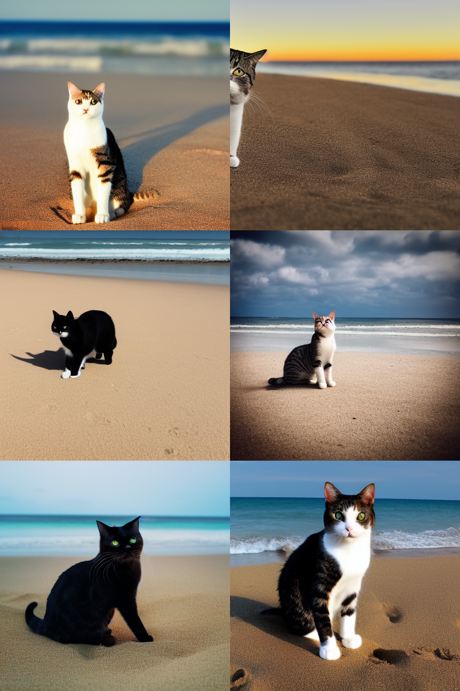

# Stable Diffusion with Hugging Face API

10 April 2023

**AIAP Group Sharing**

Presented by Group 1: Shu Ying, JF, Jia Hao and Yan Liong

## 1. Introduction

Stable Diffusion, a latent diffusion model, was developed and released by the start-up Stability AI in August 2022. The user can input a text prompt in plain English, and the model would output an image to match the given prompt. Stable Diffusion quickly made news headlines and captured the popular imagination. In February 2023, Forbes reported that Stable Diffusion is used by "more than 10 million people on a daily basis" [1].

Before the arrival of Stable Diffusion, text-to-image diffusion models such as DALL-E and Midjourney were publicly available only via cloud services. Stable Diffusion was the first diffusion model which had its code and model weights released to the public, allowing users to run the model on their own modest hardware resources. [2]

Hugging Face has gathered recent diffusion models from independent repositories in a single community project, called the `diffusers` library. [3] They utilized their library to create a Stable Diffusion API pipeline.

In this article, we walk through some code to demonstrate the use of the text-to-image diffusion pipeline by Hugging Face, which allows us to perform inferencing to generate synthetic images.

## 2. What is Stable Diffusion?

### Overview

Stable Diffusion is a type of latent diffusion model which utilises a latent diffusion process to generate high-quality images. In contrast to traditional generative models, which generate images directly in image space, Stable Diffusion operates in latent space. This approach allows for increased computational efficiency along with better control over the generative process and produces images that are visually appealing and semantically consistent.

By working in latent space, the model can generate images with fine-grained control over their features, such as the style, pose, and lighting. This approach also allows for easier manipulation of the generated images, making Stable Diffusion a valuable tool for image editing and manipulation.

Before we dive into the main components of Stable Diffusion, we need to have a brief understanding of diffusion process.

### Diffusion Process

Stable Diffusion uses both forward and backward diffusion processes to generate high-quality images. The forward diffusion process starts with an image and gradually adds noise until the vector becomes completely random. Next, the process is then reversed with backward diffusion process which gradually removes noise from the image. The combination of forward and backward diffusion allows the model to capture the complex dependencies between different parts of the image and generate visually appealing and semantically consistent images.

At each step in the diffusion process, the model applies a diffusion operator to the noise vector. The diffusion operator is a combination of a Gaussian diffusion kernel and a learnable transformation function that maps the noise vector to the image space.

### Components

For this article, we will focus on Stable Diffusion text-to-image pipeline. The text-to-image pipeline is composed of three main components, namely the Variational Autoencoder (VAE), U-Net, and a Text Encoder. These components work together to generate high-quality images from textual descriptions.

## A. Variational Autoencoder (VAE)

<div align="center" width="100%">

</div>

### Explanation of VAE component

The Variational Autoencoder (VAE) is a type of generative model that can be used to learn a low-dimensional representation of high-dimensional data. It is a neural network that consists of two parts, an encoder and a decoder. The encoder compresses an image to a lower dimensional representation in the latent space while decoder takes the latent space representation and restores the image from the latent space.

The main goal of the VAE is to learn a low-dimensional representation of the input data that captures its underlying structure. This is achieved by encoding the input data into a low-dimensional space, called the latent space, where the dimensionality of the latent space is much smaller than the input data.

### How does VAE encode images into a low-dimensional representation? How is VAE trained to learn the distribution of input images?

The VAE is different from other types of generative models in that it learns a probabilistic distribution over the latent space. This distribution is modelled as a Gaussian distribution with a mean and a variance. The mean and variance of the distribution are learned during the training process and are used to sample points in the latent space. These samples are then passed through the decoder to generate new data points that are similar to the original input data.

During the training process, the VAE is optimized to minimize the reconstruction loss and the KL-divergence between the learned latent space distribution and a prior distribution, typically a standard Gaussian distribution. The reconstruction loss measures the difference between the input data and the output generated by the decoder, while the KL-divergence measures the difference between the learned distribution over the latent space and the prior distribution. The combination of these two losses is used to train the VAE to generate high-quality output that is similar to the original input data.

### Context of Stable Diffusion

In the context of the Stable Diffusion architecture, the VAE is used to encode the input image into a low-dimensional representation, or the latent space, that captures its underlying structure. This latent space representation is then passed through the U-Net, the second component of the architecture. The VAE component is trained on a large dataset of images to learn the distribution of the input images and generate the corresponding latent space representation. The quality of the generated output images is directly dependent on the quality of the latent space representation generated by the VAE.

## B. U-Net

<div align="center" width="100%">

</div>

### Explanation of the U-Net component

U-Net is a type of convolutional neural network (CNN) that is downsampling an image into lower-dimensional representation and reconstructs it during upsampling. The downsampling and upsampling stacks communicate through skip connections. In the context of the Stable Diffusion architecture, U-Net is used to generate high-quality images from the low-dimensional representation of the input image, generated by the Variational Autoencoder (VAE).

In the context of the Stable Diffusion architecture, the U-Net is used to generate high-quality images from the latent space representation generated by the VAE. The U-Net takes the latent space representation as input and generates an output image that is similar to the original input image. The skip connections in the U-Net architecture help in the preservation of fine-grained details in the input image, which are important for generating high-quality output images. The U-Net is trained on a large dataset of images to learn the mapping between the latent space representation and the output image.

### How does U-Net transform the latent space representation into an output image? How does the skip connections in the U-Net help to preserve fine-grained details in the input image?

The U-Net architecture consists of an encoder path and a decoder path. The encoder path consists of a series of convolutional layers, followed by max-pooling layers, that progressively reduce the spatial resolution of the input image. The output of the encoder path is a low-dimensional representation of the input image, called the bottleneck or latent space representation. The decoder path consists of a series of upsampling layers, followed by convolutional layers, that progressively increase the spatial resolution of the bottleneck representation. The final output of the U-Net is an image that is the same size as the input image.

The unique aspect of the U-Net architecture is the skip connections that connect corresponding layers in the encoder and decoder paths. The skip connections allow the U-Net to preserve fine-grained details in the input image, which are lost during the max-pooling operation in the encoder path. The skip connections also enable the U-Net to propagate information from the encoder path to the decoder path, which helps in the generation of high-quality output images.

### Context of Stable Diffusion

In the context of the Stable Diffusion architecture, the U-Net is used to generate high-quality images from the latent space representation generated by the VAE. The U-Net takes the latent space representation as input and generates an output image that is similar to the original input image. The skip connections in the U-Net architecture help in the preservation of fine-grained details in the input image, which are important for generating high-quality output images. The U-Net is trained on a large dataset of images to learn the mapping between the latent space representation and the output image.

## c. Text Encoder (CLIP)

<div align="center" width="100%">

</div>

### Explanation of the Text Encoder (CLIP)

The CLIP (Contrastive Language-Image Pre-Training) text encoder is a component of the Stable Diffusion architecture, which can be used to incorporate textual information into the generation of images. CLIP is a transformer-based model that directly maps the textual input to a high-dimensional vector representation. This vector representation can be used to guide the generation of images by the VAE and U-Net components, either by concatenating it with the low-dimensional representation of the input image or by using it to guide the denoising process in the diffusion process.

CLIP is trained on a large dataset of images and their corresponding textual descriptions, which enables it to learn a rich representation of the relationship between images and text. The resulting text embeddings are highly discriminative and can capture subtle nuances in the textual input that are relevant for generating corresponding images. Furthermore, since CLIP operates in a high-dimensional space, it can capture a broader range of semantic information.

### Context of Stable Diffusion

In the Stable Diffusion architecture, CLIP can be used to generate a text embedding that is concatenated with the low-dimensional representation of the input image generated by the VAE. This concatenated vector is then passed to the U-Net for generating the output image. Additionally, CLIP can be used to generate a text embedding that is concatenated with the noise vector that is passed through the diffusion process. This concatenated vector is then used to guide the denoising process in the diffusion process, which helps in generating high-quality images that are consistent with the input text.

The incorporation of CLIP into the Stable Diffusion architecture can be useful in scenarios where textual descriptions are available for the images being generated. By leveraging the rich relationship between images and text learned by CLIP, it is possible to generate high-quality images that are consistent with the input textual descriptions. This is particularly relevant in applications such as image captioning, where a textual description of an image is used to generate a corresponding caption.

## 3. Hugging Face's Pipeline Components

### The 4 main components in Hugging Face's diffusion are:


### Text-Encoder

- The text-encoder transforms input prompts into an embedding space for the U-Net. A transformer-based encoder maps input tokens to latent text-embeddings.
- Stable Diffusion uses CLIP's pretrained text encoder, CLIPTextModel, without additional training.

### Variational Autoencoder (VAE)
- The VAE consists of an encoder and a decoder, whose main goal is to transform an image to and back from its latent space.
- During training, the encoder converts images into low-dimensional latent representations, serving as input for the U-Net model. During inference, the decoder transforms latent representations back into images.[4]

### Scheduler
- The scheduling algorithm used to progressively add noise to the image during training and remove noise during inference.

### U-Net
- U-Net has an encoder and a decoder, both composed of ResNet blocks. Its goal is to process the latent images obtained from the VAE encoder. The encoder compresses image representation into lower resolution, while the decoder reconstructs the original, less noisy, high-resolution representation.
- U-Net output predicts noise residual for denoised image calculation. Shortcut connections between encoder's downsampling and decoder's upsampling ResNets prevent information loss. Stable Diffusion's U-Net conditions its output on text-embeddings via cross-attention layers in both encoder and decoder.[4]

<br>
<br>

### For the following segment, we will utilise code excerpts from the [Stable Diffusion notebook](https://colab.research.google.com/drive/1tjza4tYRTrE3UIa5HcHK1pSRSkHBFzAP?authuser=3#scrollTo=U5w4l7d-814G) to explain the implementation of the respective components.


## Pipeline Components

<div align="center" width="100%">
[4]
</div>

<br>
<br>

### A) Creating the components

```
from transformers import CLIPTextModel, CLIPTokenizer
from diffusers import AutoencoderKL, UNet2DConditionModel, LMSDiscreteScheduler, UNet2DModel

# 1. Load the autoencoder model which will be used to decode the latents into image space.
vae = AutoencoderKL.from_pretrained("CompVis/stable-diffusion-v1-4", subfolder="vae")

# 2. Load the tokenizer and text encoder to tokenize and encode the text.
tokenizer = CLIPTokenizer.from_pretrained("openai/clip-vit-large-patch14")
text_encoder = CLIPTextModel.from_pretrained("openai/clip-vit-large-patch14")

# 3. Create the scheduler
scheduler = LMSDiscreteScheduler.from_pretrained("CompVis/stable-diffusion-v1-4", subfolder="scheduler")

# 4. The UNet model for generating the latents.
unet = UNet2DConditionModel.from_pretrained("CompVis/stable-diffusion-v1-4", subfolder="unet")
```

### B) Set up the Text Encoding

Initially, we obtain the text embeddings for the given prompt, which will serve as a basis for conditioning the UNet model.[0]

```
prompt = ["a photograph of Eiffel Tower in space"]

height = 512                        # Default height of Stable Diffusion

width = 512                         # Default width of Stable Diffusion

num_inference_steps = 100           # Number of denoising steps

guidance_scale = 7.5                # Scale for classifier-free guidance

generator = torch.manual_seed(32)   # Seed generator to create the inital latent noise

batch_size = 1                      # Batch size
```
```
text_input = tokenizer(prompt,
                       padding="max_length",
                       max_length=tokenizer.model_max_length,
                       truncation=True, return_tensors="pt")

with torch.no_grad():
  text_embeddings = text_encoder(text_input.input_ids.to(torch_device))[0]
```

Furthermore, we will acquire unconditional text embeddings to provide classifier-free guidance, which consist solely of the embeddings for the padding token (empty text). It is crucial to ensure that their dimensions match those of the conditional text embeddings (i.e., batch_size and seq_length).

```
max_length = text_input.input_ids.shape[-1]
uncond_input = tokenizer(
    [""] * batch_size,
    padding="max_length",
    max_length=max_length,
    return_tensors="pt"
)
with torch.no_grad():
  uncond_embeddings = text_encoder(uncond_input.input_ids.to(torch_device))[0]
```

To enable classifier-free guidance, we need to perform two separate forward passes. One pass is with the conditioned input (text_embeddings), while the other is with the unconditional embeddings (uncond_embeddings). To optimize computational efficiency, it is feasible to concatenate both sets of embeddings into a single batch, thus eliminating the need to perform two separate forward passes.

```
text_embeddings = torch.cat([uncond_embeddings, text_embeddings])
```

### C) Generate latent space
Next, we generate the random latent space:

```
latents = torch.randn(
    (batch_size,
    unet.in_channels,
    height // 8,
    width // 8),
    generator=generator,
)
latents = latents.to(torch_device)
```

### D) Schedulers Details

Unlike a model, a scheduler has no trainable weights (so is not inherited from torch.nn.Module), but is instantiated by a configuration. It is simply a step-by-step algorithm to compute the slightly less noisy sample. [3]

There are different types of schedulers. Different schedulers work with different models. [3]

We can print out the scheduler's configuration to take a look. Some of the more important config parameters are annotated below in the code.

```
scheduler.config
```
Output:
```
FrozenDict([('num_train_timesteps', 1000),          # Length of the denoising process
                                                    # i.e. how many timesteps are need to process random gaussian noise to a data sample.
            ('beta_start', 0.00085),                # Smallest noise value of the schedule.
            ('beta_end', 0.012),                    # Highest noise value of the schedule.
            ('beta_schedule', 'scaled_linear'),     # Type of noise schedule that shall be used for inference and training.
            ('trained_betas', None),
            ('prediction_type', 'epsilon'),
            ('_class_name', 'PNDMScheduler'),
            ('_diffusers_version', '0.7.0.dev0'),
            ('set_alpha_to_one', False),
            ('skip_prk_steps', True),
            ('steps_offset', 1),
            ('clip_sample', False)])
```

### E) Updating the Current Schedulers

We update the scheduler with our chosen `num_inference_steps`. This will compute the sigmas and exact time step values to be used during the denoising process.

```
scheduler.set_timesteps(num_inference_steps)
```

The scheduler necessitates the multiplication of latents with their corresponding sigma values. We can accomplish this step at this point.

```
latents = latents * scheduler.init_noise_sigma
```

### F) Denoising loop

The denoising loop turns the latent noisy image into denoised latent images using the scheduler. [4]

```
from tqdm.auto import tqdm
from torch import autocast

for t in tqdm(scheduler.timesteps):
  # expand the latents if we are doing classifier-free guidance to avoid doing two forward passes.
  latent_model_input = torch.cat([latents] * 2)

  latent_model_input = scheduler.scale_model_input(latent_model_input, t)

  # predict the noise residual
  with torch.no_grad():
    noise_pred = unet(latent_model_input, t, encoder_hidden_states=text_embeddings).sample

  # perform guidance
  noise_pred_uncond, noise_pred_text = noise_pred.chunk(2)
  noise_pred = noise_pred_uncond + guidance_scale * (noise_pred_text - noise_pred_uncond)

  # compute the previous noisy sample x_t -> x_t-1
  latents = scheduler.step(noise_pred, t, latents).prev_sample
```

### G) Decode generated latents

Finally, we will utilize the `vae` to decode the generated latents and recover the denoised image.

```
# scale and decode the image latents with vae
latents = 1 / 0.18215 * latents

with torch.no_grad():
    image = vae.decode(latents).sample
```

### H) Display image

```
from PIL import Image

image = (image / 2 + 0.5).clamp(0, 1)
image = image.detach().cpu().permute(0, 2, 3, 1).numpy()
images = (image * 255).round().astype("uint8")
pil_images = [Image.fromarray(image) for image in images]
pil_images[0]
```
<div align="center" width="100%">

</div>

Refer to [Stable Diffusion notebook](https://colab.research.google.com/drive/1tjza4tYRTrE3UIa5HcHK1pSRSkHBFzAP?authuser=3#scrollTo=U5w4l7d-814G) for detailed implementation.

## 4. Application -> Text-to-image output demo
First, install and import the necessary libraries
```
 !pip install --upgrade diffusers[torch]
 !pip install transformers
 from diffusers import StableDiffusionPipeline
```
Instantiate the pipeline and download the pre-trained model; if you have a CUDA-enabled GPU, you can move the pipe object there to speed up processing.
```
pipe = StableDiffusionPipeline.from_pretrained("runwayml/stable-diffusion-v1-5")
pipe = pipe.to("cuda")
```

To generate an image, just pass a text prompt into the pipe
```
prompt = "a photo of an cat on a beach"
image = pipe(prompt).images[0]
image
```
<div align="center" width="100%">

</div>

As you can see above, our prompt "a photo of a cat on a beach" generates exactly that.

### a) Multiple images from the same prompt
A different image is generated each time you pass in the prompt, even if it's the same one. So if you wanted multiple different pictures of cats at beaches, you could do this:

Create a helper function to display multiple images in a grid:
```
# Helper function to create image grid
from PIL import Image

def image_grid(imgs, rows, cols):
    assert len(imgs) == rows*cols

    w, h = imgs[0].size
    grid = Image.new('RGB', size=(cols*w, rows*h))
    grid_w, grid_h = grid.size

    for i, img in enumerate(imgs):
        grid.paste(img, box=(i%cols*w, i//cols*h))
    return grid
```
Generate the images and display in a grid:
```
num_cols = 2
num_rows = 3

prompt = ["a photo of an cat on a beach"] * num_cols

all_images = []
for i in range(num_rows):
  images = pipe(prompt).images
  all_images.extend(images)

grid = image_grid(all_images, rows=num_rows, cols=num_cols)
grid
```

<div align="center" width="100%">

</div>

### b) Keeping images the same
To generate the same image every time, we can create and pass the same generator object into the pipe:

```
# to get the same image every time;
import torch

generator = torch.Generator("cuda").manual_seed(42)
# run the above line every time with the same manual seed
# before generating the image if you want to get back the same image / similar image (with other settings tweaked)

image = pipe(prompt, generator=generator).images[0]
image
```

<div align="center" width="100%">

</div>

This is useful if you want to experiment with different settings and see what they do to a base image. For example, you could change the number of inference / sampling steps:
```
# same generator, much higher number of inference steps (75), quality does not increase significantly from 50 steps
generator = torch.Generator("cuda").manual_seed(42)
image = pipe(prompt, generator=generator, num_inference_steps=75).images[0]
image
```
Here, we changed steps to 75 (default is 50). Increasing the number of steps also increases the amount of time it takes to generate the image. And since we are using the same generator object, this just produces a slightly different image. As a side note, based on our own experimentation, a higher number of steps may not necessarily produce a better image.

<div align="center" width="100%">

</div>

If a much lower number is used for the number of steps, the image produced is less than ideal. The image below was produced with the same generator and prompt using only 5 inference steps

<div align="center" width="100%">

</div>

### c) Switching Schedulers

To see a list of compatible schedulers you can use
```
pipe.scheduler.compatibles
```
Output:
```
[diffusers.schedulers.scheduling_k_dpm_2_discrete.KDPM2DiscreteScheduler,
 diffusers.schedulers.scheduling_ddpm.DDPMScheduler,
 diffusers.schedulers.scheduling_dpmsolver_multistep.DPMSolverMultistepScheduler,
 diffusers.schedulers.scheduling_euler_discrete.EulerDiscreteScheduler,
 diffusers.schedulers.scheduling_ddim.DDIMScheduler,
 diffusers.schedulers.scheduling_k_dpm_2_ancestral_discrete.KDPM2AncestralDiscreteScheduler,
 diffusers.schedulers.scheduling_lms_discrete.LMSDiscreteScheduler,
 diffusers.schedulers.scheduling_euler_ancestral_discrete.EulerAncestralDiscreteScheduler,
 diffusers.schedulers.scheduling_heun_discrete.HeunDiscreteScheduler,
 diffusers.schedulers.scheduling_unipc_multistep.UniPCMultistepScheduler,
 diffusers.schedulers.scheduling_deis_multistep.DEISMultistepScheduler,
 diffusers.schedulers.scheduling_dpmsolver_singlestep.DPMSolverSinglestepScheduler,
 diffusers.schedulers.scheduling_pndm.PNDMScheduler]
```

By default, Stable Diffusion uses the PNDMScheduler. We can switch this out with a different compatible scheduler, such as the DDPMScheduler:

```
from diffusers import DDPMScheduler
pipe.scheduler = DDPMScheduler.from_config(pipe.scheduler.config)
```

Generate the image with DDPMScheduler using the same generator, prompt, and steps
```
generator = torch.Generator("cuda").manual_seed(42)
image = pipe(prompt, generator=generator, num_inference_steps=50).images[0]
image
```

<div align="center" width="100%">

</div>

### d) Other pre-trained models
There are many other [pre-trained models available](https://huggingface.co/models?other=stable-diffusion).

A fun one is [Pokemon Stable Diffusion](https://huggingface.co/justinpinkney/pokemon-stable-diffusion):

```
pokemonpipe = StableDiffusionPipeline.from_pretrained("justinpinkney/pokemon-stable-diffusion")
pokemonpipe = pokemonpipe.to("cuda")
prompt = "a photo of a cat on a beach"
generator = torch.Generator("cuda").manual_seed(42)
image = pokemonpipe(prompt, generator=generator, num_inference_steps=50).images[0]
image
```

<div align="center" width="100%">

</div>

Google Colab Notebook with [demo code](https://colab.research.google.com/drive/1_euD6siX6xJiMI41hh6v1XaG5qnmVdJS?usp=sharing).

## 5. End Notes

In this article, we provide a comprehensive overview of the stable diffusion concept and offer a step-by-step guide to implementing it using the Hugging Face's Diffusion API, a widely-used platform for natural language processing and machine learning. By following our guide, you can now easily incorporate Stable Diffusion into your own projects to create dynamic and engaging content!

It is important to note that this blog focuses solely on the backward diffusion processes (inferencing) to generate high-quality images. However, if you are interested in learning about the forward diffusion process (training), we recommend checking out this [jupyter notebook](https://colab.research.google.com/gist/anton-l/f3a8206dae4125b93f05b1f5f703191d/diffusers_training_example.ipynb#scrollTo=67640279-979b-490d-80fe-65673b94ae00). It provides a detailed explanation of how to train your own model, which can then be integrated into the diffusion pipeline to further enhance your results.


## References

[1] Six Things You Didn’t Know About ChatGPT, Stable Diffusion And The Future Of Generative AI. https://www.forbes.com/sites/kenrickcai/2023/02/02/things-you-didnt-know-chatgpt-stable-diffusion-generative-ai/?sh=605dc9c1b5e3

[2] Wikipedia: Stable Diffusion. https://en.wikipedia.org/wiki/Stable_Diffusion

[3] Introducing Hugging Face's new library for diffusion models. https://colab.research.google.com/github/huggingface/notebooks/blob/main/diffusers/diffusers_intro.ipynb

[4] Stable Diffusion. https://colab.research.google.com/github/huggingface/notebooks/blob/main/diffusers/stable_diffusion.ipynb#scrollTo=DwwaTOxRuzWj
